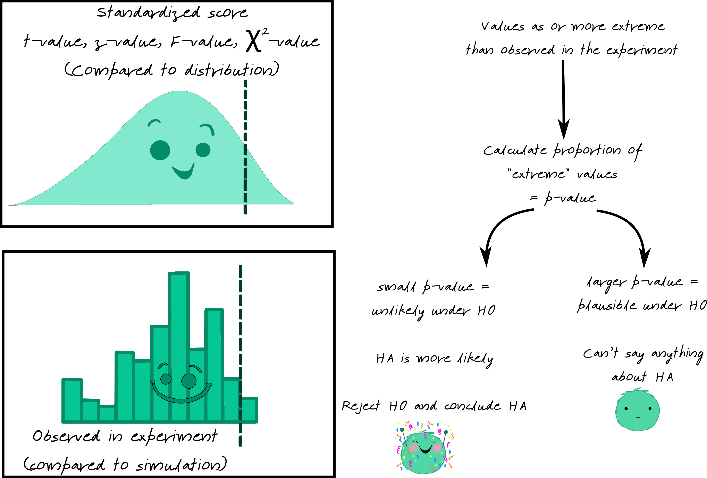
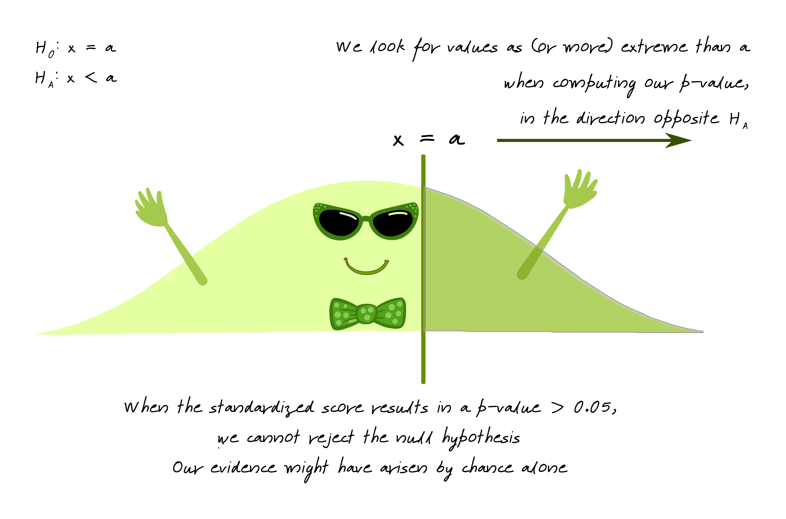
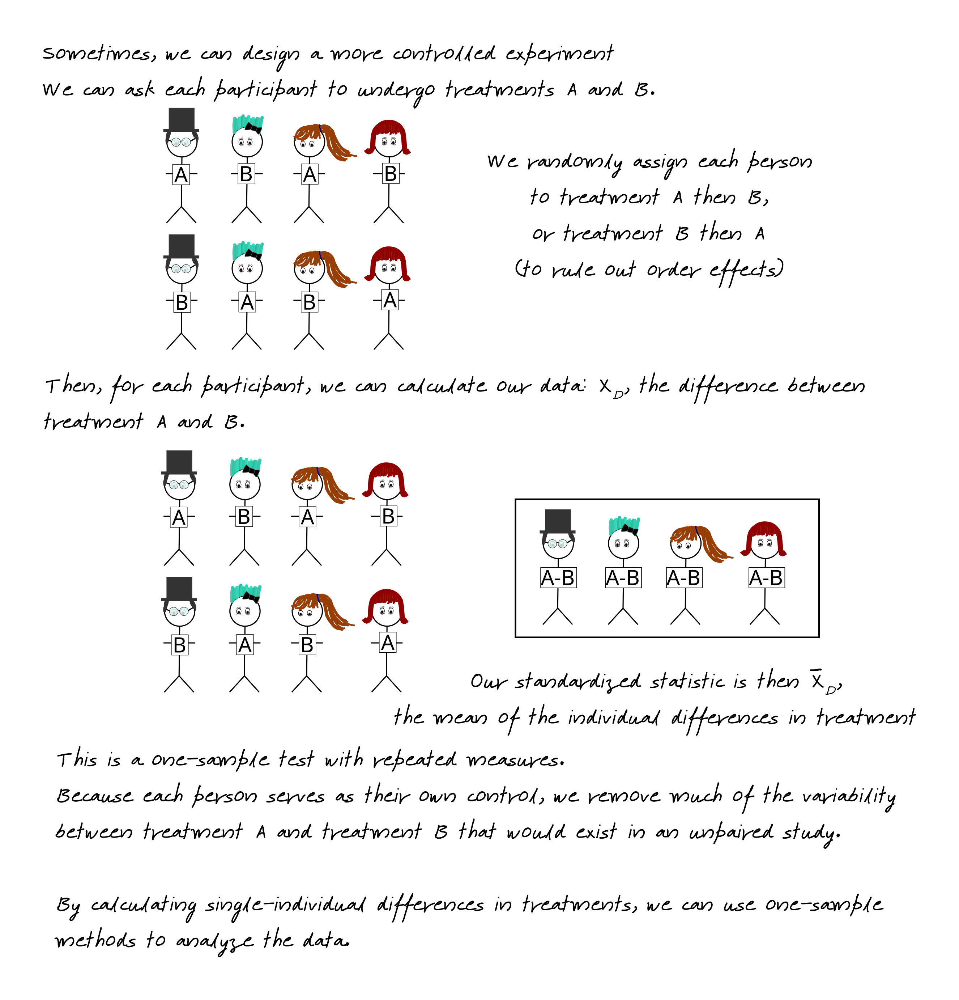
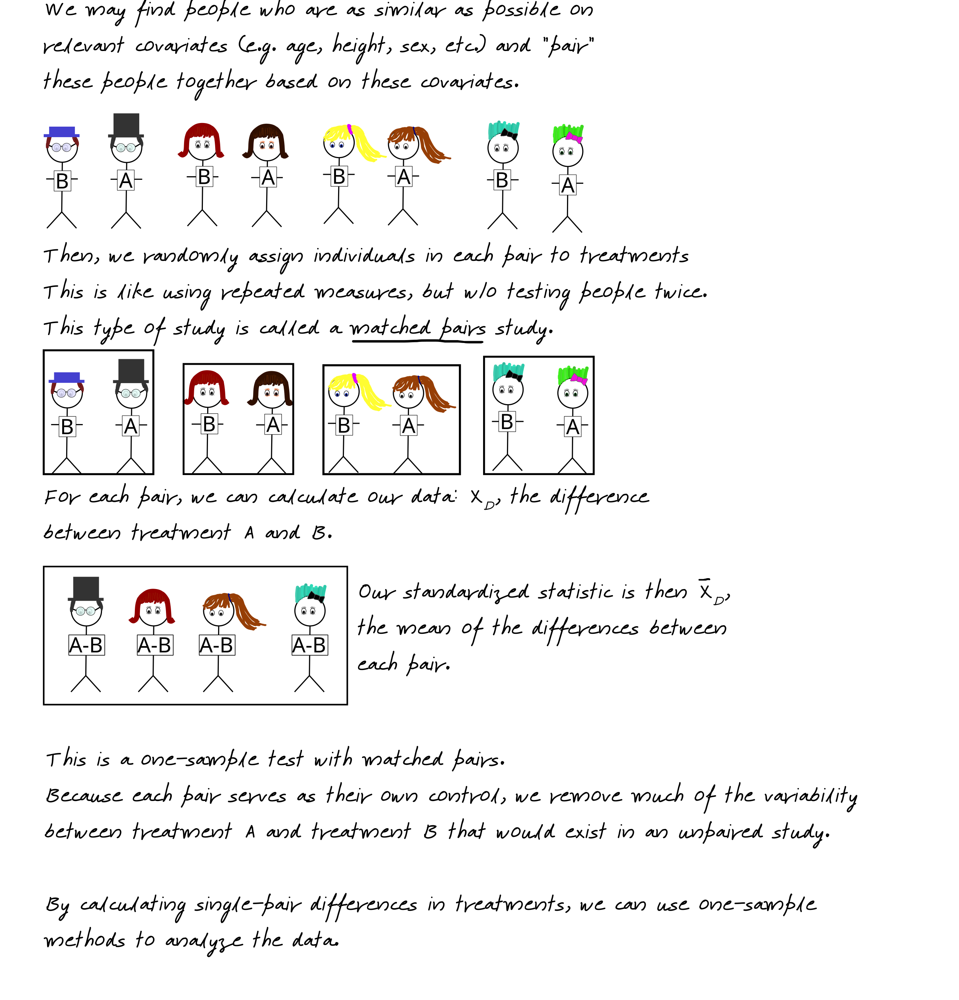
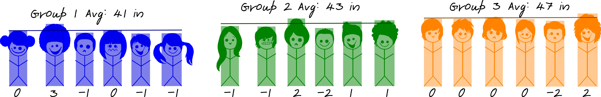
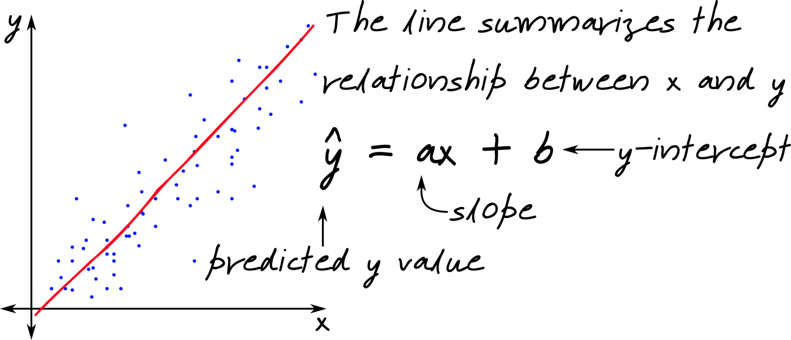

# Experimental Design and Statistical Analysis

::: time
200 minutes
:::

Next, provide an overview focusing on a discussion of the basic principles underlying controlled versus observational studies, and how their underlying study design differences ultimately determine the nature of experimental conclusions that they can claim (i.e., causal versus association or correlational-based conclusions).  This is a good time to connect back to the different types of scientific studies that were discussed by students during the scientific literature exercise the previous day.  For example, a possible jab to stimulate discussion “why is it the case that in study A (a highly controlled study) versus study B (an observational study) that the scientists talk about causation, whereas in study B only correlational or association based claims are made—because both findings are statistically significant”? This is a lead-in to describing the nature of a controlled study, as well as how one thinks about experimental design in this context. It is recommended that you customize the problem based learning activity from handout X to cover important concepts and terminology related to these topics. This handout features PBL activities, that utilize a variety of case study examples from many different fields—field work, animal work, human work, bench work, environmental work, ect—to practice identifying different levels of controlled based experimental design, as well as the key aspects that define them.  After the exercise, for homework, have students return to their master concept map, and add on an additional concept that covers experimental design components they identified and conceptualized in the activity.  

The next class period, go over the student concept maps briefly, ensuring that core concepts are included and linked.  Next, begin an open-ended brainstorming session about the nature of data analysis and making experimental conclusions—this should be a segway that connects experimental design with statistical analysis.  In other words, assuming there is a proper experimental design employed, how do scientists determine if they have an experimental treatment effect or whether their results are significant? Next, it is recommended that you use the active learning activities and materials provided by Dr. Vanderplas to overview a discussion about statistics (See web based material).  

Following completion of these modules, students are tasked with creating a concept map that summarizes key terms and concepts pertinent to the previous overview on statistics and the experimental methods that they just learned about.  This should be done for homework over the next few days.


## The Logic of Statistical Hypothesis Testing

Sir Ronald Fisher once had a conversation with a woman who claimed to be able to tell whether the tea or milk was added first to a cup. Fisher, being interested in probability, decided to test this woman's claim empirically by presenting her with 8 randomly ordered cups of tea - 4 with milk added first, and 4 with tea added first. The women was then supposed to select 4 cups prepared with one method, but is allowed to directly compare each cup (e.g. tasting each cup sequentially, or in pairs). 

The lady identified each cup correctly. Do we believe that this could happen by random chance alone?^[A more thorough explanation of this experiment is available [here](https://en.wikipedia.org/wiki/Lady_tasting_tea) - the tea tasting experiment is one of the pillars of early statistics and randomization-based hypothesis testing.]

### Initial statistical setup {-}

- Null Hypothesis (what we are hoping to disprove):    
There is no observable difference between the two methods of preparing tea (any success is by chance alone). 

- Alternative Hypothesis (if random chance isn't the reason, then what?):    
There is an observable difference between the two methods of preparing tea, that is, the woman can actually detect via taste which cups were prepared using either method.


If the results we observed are due to random chance alone, how common would it be to get 8/8 correct? 

### Simulation {-}

1. Flip a coin 4 times to represent the 4 cups identified as containing tea with milk added first. Heads corresponds to a correct decision, Tails to an incorrect decision.
2. Record the number of successful selections

3. Repeat 100 times to generate a distribution of results under the null hypothesis -- that is, what our results would look like if the lady is just guessing.    
Note: in a classroom setting, you can have each person generate several data points using actual coin flips to get this distribution.

```{r, echo = F, out.width = "49.5%", fig.show = "hold", fig.cap = "Simulated results (left), and simulated results evaluated in light of our observed data.", fig.width = 5, fig.height = 4}
set.seed(24094703)
library(ggplot2)
library(tibble)
res <- tibble(x = rbinom(100, 4, .5))
res$fill <- factor(ifelse(res$x == 4, "As extreme", "Not as extreme"))

ggplot(data = res, aes(x = x)) + geom_bar() + xlab("# Correct Cups Identified") + ylab("# Simulations") + ggtitle("Results of Tea Test Under Random Chance")

ggplot(data = res, aes(x = x, fill = fill)) + geom_bar() + 
  scale_fill_discrete("Compared to\nObserved Value") + 
  xlab("# Correct Cups Identified") + ylab("# Simulations") + 
  ggtitle("Results of Tea Test Under Random Chance") + 
  theme(legend.position = c(1, 1), legend.justification = c(1,1), legend.background = element_rect(fill = "transparent", color = "black"))
```


### Strength of the Evidence {-}

Our simulation shows that under random chance, it appears that our tea taster would be expected to identify all of the cups correctly (corresponding to HHHH) 4/100 = 0.04 times. 

::: define
0.04 in this example corresponds to our **p-value** - the probability under the null hypothesis of observing the results from our experiment.
:::

0.04 is a fairly low value, so we might say that we don't believe that the results are sufficiently likely under our null hypothesis. In this case, the probability of observing the results under the null hypothesis is low, so we might instead conclude that the alternative hypothesis seems more reasonable -- that is, it is more likely that the null hypothesis is wrong. 
So, we might instead conclude that because our p-value is so low, that is, that we are unlikely to observe results this extreme under random chance, that instead we believe that the lady is not guessing and can actually detect the difference in tea prepared in different ways. We **reject the null hypothesis and conclude that the alternative is more likely**.

Now, in this example, we have a relatively low sample size -- which means that it is hard for us to find evidence too much stronger than what our simulation provided for us. In many situations in science, however, we may require **stronger evidence** that the null hypothesis is unlikely to generate results that we have observed -- corresponding to requiring a p-value that is lower than 0.05. The correct threshold value ("alpha") for rejecting a null hypothesis differs by discipline (physics may use values like $10^{-6}$) and by the consequences of the results (medical trials may require small p-values, while studies looking for avenues to explore may use higher p-values.)


### Connection to Theory-based Tests {-}

The simulation method described above for evaluating the probability of observing the evidence under the null hypothesis relies on significant manual simulation or outsourcing that work to a computer. The results are not guaranteed to be the same every time, and before computers were common, the manual simulation approach was often too tedious to use regularly. Thus, probability distributions describing the results mathematically were used instead. 


No matter what distribution the researcher uses to compare to, the basic idea of theory-based statistics is the same: we look for **evidence that our result is (or is not) likely under the null hypothesis**. If the result is likely under the null, then we can't say anything -- we can't disprove the idea that the results are due to chance. If the result isn't likely under the null, then we reject the null hypothesis and say the alternative is more likely. 

In theory-based tests, this evidence is usually in the form of **a \_\_-value**, where the blank is the name of the distribution (commonly, $z$, $t$, $F$, $\chi^2$). 



### Understanding p-values {-}

The p-value is the probability of observing the data we saw under the null hypothesis $H_0$. A p-value is the **area under the reference distribution** where values are **as or more extreme** than the hypothesized value.



If the p-value is low ($p < \alpha$, where $\alpha = 0.05, 0.01$, or another pre-specified value) then we know that it is relatively unlikely to observe our data under $H_0$... which means that it is more likely that $H_0$ is false and $H_A$ is true. 

When p-values are low, we **reject $H_0$ and conclude that $H_A$ is more likely**.


Not all alternative hypotheses are one sided, e.g. $x > a$. Some hypotheses are two sided - $H_0: x = a$ and $H_A: x \neq a$. When we have a two-sided hypothesis, we have two areas of our distribution that contribute to the p-value. 


## Estimating Values: Confidence Intervals

Sometimes, we don't want to test whether a parameter is equal to a specific value - instead, we might want to know what that value is (or at least, a range of possible values for that parameter). 

In this case, we construct a **confidence interval** - a set of plausible values for the parameter.

We can think of a confidence interval as our best estimate of the parameter value + uncertainty.


Confidence intervals, like hypothesis tests, are conducted based on a parameter $\alpha$ representing the acceptable level of error. If we want to be 95% confident in our estimate, our interval will be **wider** than if we want to be 90% confident in our estimate -- we have to include more values to get a wider interval.

## Experimental Design

Many studies have a design which is more complicated than the simple examples shown in the previous section. However, all of these designs use the same statistical principles - they may just be applied in different ways.

What follows is a brief description and depiction of how these different experimental designs work in practice. Focus primarily on the way the experiments are set up -- in the end, there is always a test statistic computed from the sample mean(s) and variance(s) which is compared to a distribution, as described above.

<!-- Two sample test example -->
### Two Sample Tests

In a two-sample test, there are two groups of participants which are assigned different treatments. The goal is to see how the two treatments differ. Because there are two groups, the mathematical formula for calculating the standardized statistic is slightly more complicated (because the variability of $\overline{X}_A - \overline{X}_B$ is a bit more complicated), but in the end that statistic is compared to a similar reference distribution.


<!-- Paired vs unpaired tests -->

### Matched Pairs and Repeated Measures

In a variation on this theme, in some cases, we may want to compare two treatments, but we may design the experiment to reduce variability using either repeated measures or matched pairs. 

A repeated measures study requires each participant to experience both treatments in the experiment. 




Sometimes, it is not ethical or feasible to give the same individual both treatments -- for instance, we cannot ethically or logistically assign mothers to breastfeed or formula feed with the same baby -- and so instead, we must create pairs of individuals who are similar.



### Analysis of Variance

<!-- Multiple variables (ANOVA) -->
In other cases, we may be more interested in sources of variability in the data.


If a variable is important, then it should account for more variability in the data than the overall variability between two observations. In this example, that means that children within a grade should be more similar than children who are from different grades.





ANOVA models are sometimes shown in tables like this:

```{r, include = F}
library(tidyverse)

data <- tibble(group = rep(1:3, each = 6), 
       groupavg = rep(c(41, 43, 47), each = 6),
       dev = c(0, 3, -1, 0, -1, -1, -1, -1, 2, -2, 1, 1, 0, 0, 0, 0, -2, 2))

data <- mutate(data, height = groupavg + dev, grade = factor(group))

anova(lm(height ~ grade, data = data))
```
```{r, echo = F}
options(knitr.kable.NA = '') 
as_tibble(anova(lm(height ~ grade, data = data))) %>%
  mutate(Factor = c("grade", "Residuals")) %>%
  select(Factor, everything()) %>%
  bind_rows(tibble(Factor = "Total", Df = 17, `Sum Sq` = 144, `Mean Sq` = NA, `F value` = NA, `Pr(>F)` = NA)) %>%
  knitr::kable()
```


The overall statistic we calculate is the ratio of the sum-of-squares within groups to the sum-of-squares between groups. The mathematical details of this aren't that important here, unless they make the process easier to understand.


Between group SS: 
$6 * (43.77 - 41)^2 + 6* (43 - 43.77)^2 + 6 * (47 - 43.77)^2 = 42.77 + 2.69 + 66.53 = 112$

Within group SS:
$$\left(0^2 + 3^2 + (-1)^2 + 0^2 + (-1)^2 + (-1)^2\right) + \\
\left((-1)^2 + (-1)^2 + 2^2 + (-2)^2 + 1^2 + 1^2\right) + \\
\left(0^2 + 0^2 + 0^2 + 0^2 + (-2)^2 + 2^2\right) = 32$$

So by adding the group variable, we reduce our total error from 144 (112 + 32) to 32. Not bad! Put another way, our group variable explains some 77% of the overall variability in the data. 

ANOVA models calculate out an F-statistic which is compared to an F-distribution. This F-statistic is calculated as the ratio of the Mean Sq. for each group - the sum of squared errors for each group (between, within) divided by the degrees of freedom (the number of observations - 1). In this case, our F value (with 2, 15 degrees of freedom) is 26.25. This corresponds to a p-value of 0.00001262 -- so the chances of observing something this significant when there is in fact no difference between groups is *very* low.

```{r, fig.cap = "It is clear that 26.25 is very much in the tails of the F(2, 15) distribution, which explains the extremely low p-value.", echo = F, fig.width = 4, fig.height = 3, out.width = "50%", fig.align = "center"}
ggplot() + 
  xlim(c(0, 30)) + 
  geom_function(fun = df, args = list(df1 = 2, df2 = 15)) + 
  geom_text(aes(x = 0.25, y = 1, label = "F(2, 15) distribution"), hjust = 0) + 
  theme(axis.title = element_blank())
```


### Linear Regression
<!-- Regression Intro -->


It's fairly common in science to have two continuous quantitative variables -- for instance, height and weight, or fertilizer applied and yield. When we have data like this, we use linear regression to fit a regression line to the data. This line minimizes the errors in $y$, and is sometimes called the **least squares regression line**.




Generally, though, our data are not fixed: they are the result of sampling. If this is the case, then we know that a different sample may provide a different result. Thus, we know that any estimates $a$ and $b$ have variability that directly results from **how we collected the data**.


As a result, we generally have a **distribution** of values corresponding to $a$ and a similar **distribution** of values corresponding to $b$. Because our data are the result of a random sample, we can analyze the least squares regression coefficients using statistical techniques.

We may want to test hypotheses about $a$ such as "Is there a relationship between $x$ and $y$?" (This doesn't mention $a$, but if there is no relationship between $x$ and $y$, then $a$ would be 0, so implicitly, we're asking whether $a = 0$.) Typically, scientists aren't as interested in the value of $b$. 

We can test these hypotheses using simulation by arranging our data as if there is no relationship between $x$ and $y$ - that is, by shuffling our $y$ data to correspond to a random $x$ value in the dataset. Then, we would fit a new regression line and record the value of $a^\ast$ (the simulated $a$). 

Just like before, when we shuffled data or labels, we generate a distribution of $a^\ast$ under the null hypothesis and compare our observed value to that distribution, counting up the number of values which are more extreme.

